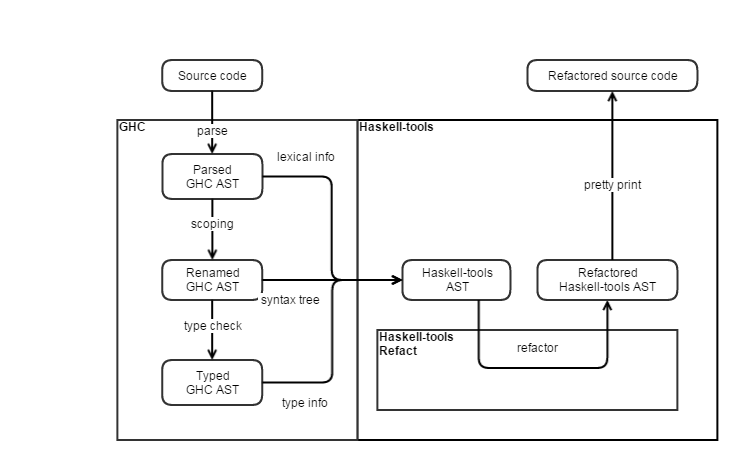

# Haskell-tools overview

Haskell-tools is backed by the [GHC API](https://downloads.haskell.org/~ghc/8.0.2/docs/html/libraries/ghc-8.0.2/). The GHC AST is converted into a syntax tree optimized for both analysis and modification. This also makes it easier to keep up with the latest GHC version. Aside from source information, the nodes of the syntax tree also carry semantic information, for example unique names extracted from the GHC AST.

The ht-refact tool works in a purely AST-based way. The traditional problem with purely syntax tree based transformations is that they don't keep comments or layout (it is not part of the syntax tree). We solved this problem by annotating the syntax tree with additional information regarding the original format of the source code of a given AST element. So every transformation is basically a mapping of syntax trees. This makes writing refactorings easier, since we don't have to synchronize the token streams with the syntax trees. As it can be seen most refactorings are around a hundred lines of code or shorter.

We create our own Haskell representation based on GHC's representation. We combine the information that can be found at different stages of the compilation into a representation that contains all the necessarry information for refactoring. The resulting representation is also good for pretty-printing. If the source code is not correct, but some GHC steps can be performed, our representation can be built, but with less semantic information available.

Our representation goes through several steps to obtain the source-related information to be pretty-printable. The resulting representation contains the nodes with the original source code where the position of the children nodes are marked. This way when a child node changes, only that part of the source code is changed that is connected to the changed child.
